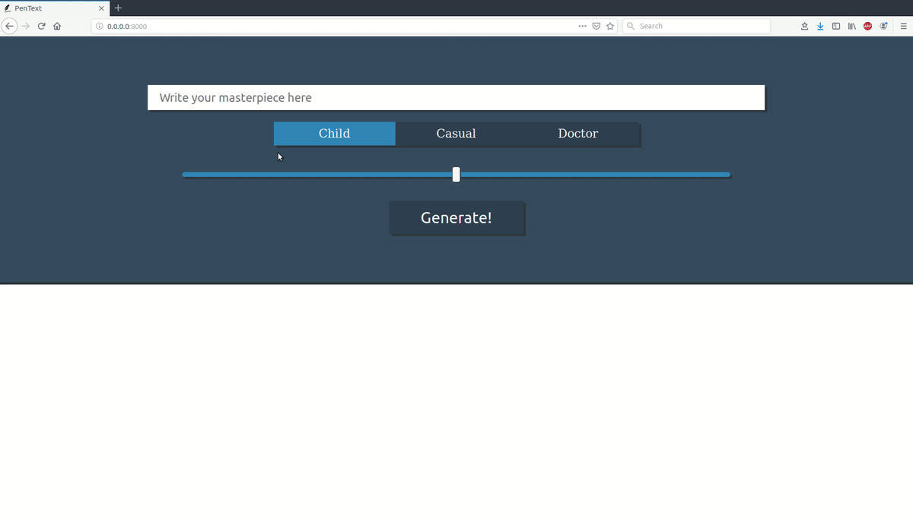

# Handwritten text generator



This work is based on [Generating Sequences With Recurrent Neural Networks](https://arxiv.org/abs/1308.0850) by Alex Graves.
This model was trained on `IAM On-Line Handwriting Database` ([data/original-xml-part.tar.gz](http://www.fki.inf.unibe.ch/databases/iam-on-line-handwriting-database/download-the-iam-on-line-handwriting-database) file)

You can start your server everywhere with simple commands

## Requirements
* Docker (install using `bash install_docker.sh`)

#### Install and run:
```
docker build -t flask_gunicorn_app_image . -f src/deploy/app/Dockerfile
docker run -d --name flask_gunicorn_app -p 8000:8000 flask_gunicorn_app_image
```
Or alternatively:
```
bash build.sh
```

#### Start:
```
docker start flask_gunicorn_app
```

#### Stop:
```
docker stop flask_gunicorn_app
```

#### Logs:
```
docker logs flask_gunicorn_app
```

#### Remove:
```
docker stop flask_gunicorn_app
docker rm flask_gunicorn_app
docker rmi flask_gunicorn_app_image
docker volume prune -f
```
Or alternatively:
```
bash remove.sh
```

#### Local build:
```
bash local_build.sh
```

##### Developed by: Vasyl Borsuk, Volodymyr Zabulskyy and Roman Vey
